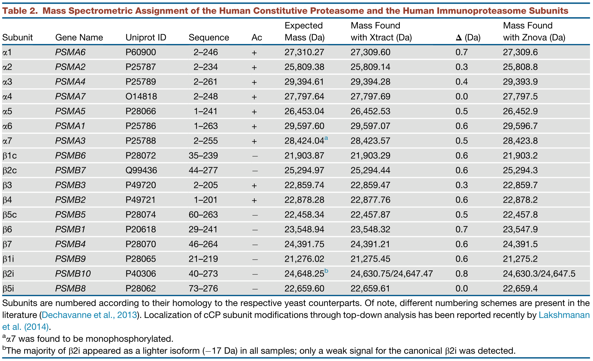
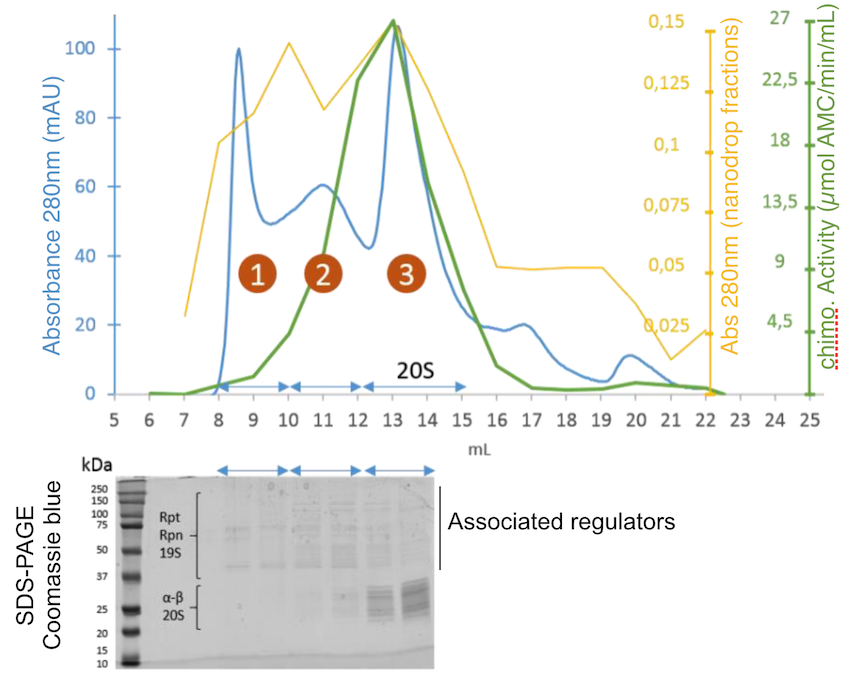

<!-- {::options parse_block_html="true" /} -->

<style>
div.blue { background-color:#DAEAEC; border-radius: 5px; padding: 8px 8px 2px 20px; color: darkblue;}
div.orange { background-color:#FBDBAE; border-radius: 5px; padding: 8px 8px 2px 20px; color: darkred;}
div.yellow { background-color:#FFFBD0; border-radius: 5px; padding: 8px 8px 2px 60px; color: grey30;}
</style>


```{r setup, include=FALSE}
knitr::opts_chunk$set(echo = TRUE)
```

<br>
<br>
<br>
<br>

In this workshop, we will use **VisioProt-MS**  (@Locard-Paulet2018) to analyse two forms of the proteosomal core particule (work inspired from @Gersch2015).

### Composition of the core particule of the proteasome:

The 20S core particule of the proteasome is constituted of 4 rings constituted by 7 subunits each in a \( \alpha7 \):\( \beta7 \):\( \beta7 \):\( \alpha7 \) stoichiometry. Amongst these, only \( \beta1 \), \( \beta2 \) and \( \beta5 \) are catalytically active, and during inflammation, they can be exhanged with alternative \( \beta1i \), \( \beta2i \) and \( \beta5i \) to form the immunoproteasome.

Their most common post-translational modifications (PTMs) are:

* Serine/threonine phosphorylation: + 80 Da
* N-terminal truncation: variable \( \Delta \) mass.
* Loss of the N-terminal methionine: - 131.19 Da
* Acetylation: + 42 Da
* Oxydations: + 15 Da

Molecular weights of the subunits identified by @Gersch2015:



***********************************

# 1. Comparison of commercial samples of the standard and immuno proteasome core particules

The aim of this exercise is to compare the composition of commercial standard 20S (std20S) and immuno-20S (i20S). 

### Input data

We will work with the top-down MS data after deconvolution with RoWinPro:

* Top-down MS analysis of the std20S: [ProteasomeCommercial_std20S_MS.csv](input_data/ProteasomeCommercial_std20S_MS.csv)
* Top-down MS analysis of the i20S: [ProteasomeCommercial_i20S_MS.csv](input_data/ProteasomeCommercial_i20S_MS.csv)

### Step by step instructions

1. Load the files in the `MS` panel of VisioProt-MS. You can:
    * load them one at a time to have a feel for their respective signal and adapt the signal threshold for plotting. This will also allow you to check which proteoforms are the most abundant in case of clusters of elution peaks.
    * load them both at the same time to directly identify which proteoforms are present in only one or the two samples.
  
<div class = "orange">
<strong>!</strong> Due to technical reasons, there can be a difference in the proteoform elution times between runs.
</div>


2. Zoom in on the region(s) of interest.
3. Use the option `show data label` to get the molecular weigths of the proteoforms of interest (you may need to zoom in further to distinguish the different eluted forms that correspond to a given proteoform).

<div class = "blue">
<strong>Tip:</strong> I advise you to create figures with the buttons `Download .pdf/.png/.svg` and create a working document (word, ppt, image...) that you can annotate.
</div>

### Questions

* Do you find all the subunits expected in the std20S and i20S?
* Are some subunits modified?
* Is the std20S pure?
* Is the i20S pure?
* Make a figure / figures to illustrate your findings.

---------------------------------

## 2. Home-made purification of i20S using Size-exclusion chromatography (SEC)

\( \beta1i \), \( \beta2i \) and \( \beta5i \) were expressed in HEK293T-EBNA and the proteasome core particules were immuno-purified (IP) with an anti-\( \alpha2 \). Then, a SEC was performed to separate the std20S and i20S for their separate characterisation.



#### Useful information:

* Theoretical mass of HNRPC1 (P07910-2): 32338 Da
* Theoretical mass of HNRPC2 (P07910-1): 33670 Da

These are the 2 components of the [Heterogeneous nuclear ribonucleoproteins C1/C2](https://www.uniprot.org/uniprot/P07910) that bind to mRNA. These may have been co-immunopurified with the proteosomal core particules during the IP.

### Input data

The sample before SEC has been analysed by top-down MS and MS/MS. The associated files are:

* MS trace of the sample after RoWinPro deconvolution: [ProteasomeBeforeSEC_MS.txt](input_data/ProteasomeBeforeSEC_MS.txt)
* MS/MS: [ProteasomeBeforeSEC_MSMSSpectrumInfo.txt](input_data/ProteasomeBeforeSEC_MSMSSpectrumInfo.txt)
* Results of the MS/MS search (Biopharma Finder): [ProteasomeBeforeSEC_PSMs.txt](input_data/ProteasomeBeforeSEC_PSMs.txt)

Analysis of the fractions eluted from SEC in top-down MS (after RoWinPro deconvolution):

* Top-down MS analysis of fraction 1: [ProteasomeFraction01_MS.csv](input_data/ProteasomeFraction01_MS.csv)
* Top-down MS analysis of fraction 2: [ProteasomeFraction02_MS.csv](input_data/ProteasomeFraction02_MS.csv)
* Top-down MS analysis of fraction 3: [ProteasomeFraction03_MS.csv](input_data/ProteasomeFraction03_MS.csv)

### Step by step instructions

1. Load files corresponding to the 3 fractions after SEC in the `MS` panel of VisioProt-MS. Like for the first part of the workshop, you can:
    * load them one at a time to have a feel for their respective signal and adapt the signal threshold for plotting. This will also allow you to check which proteoforms are the most abundant in case of clusters of elution peaks.
    * load them both at the same time to directly identify which proteoforms are present in only one or the two samples.
  
<div class = "orange">
<strong>!</strong> Loading 3 files at a time can be long. It will be faster if you uncheck the `show data label` box and reduce the initial threshold (number of points to be plotted).
</div>

2. Zoom in the region of interest (we expect all the subunits of the proteasome to be eluted between 12.5 and 18 min, with molecular weights between 20000 and 30000 Da).

<div class = "blue">
<strong>Tip:</strong> When you have checked the box `show data label`, it is possible to hide the points of a specific sample by clicking on it in the legend. Click again to make it reappear.
</div>

<br>

<div class = "blue">
<strong>Tip:</strong> You can try overlaying the top-down MS runs of the commercical std20S and i20S used in the first part of this workshop to identify the subunits of the core particule of the proteasome. Be aware that there may be a shift in retention times.
</div>

### Questions

* Do you find all the subunits expected? Did the SEC allow a the purification of the i20S? If yes, what fraction would you choose to study the i20S?
* Are some subunits modified? @Gersch2015 detected \( \alpha7 \) with a phosphorylation. Can you see it in any of the fractions?
* What is the mass of the major contaminant in the sample before SEC? Can you identify it?
* Make figures to illustrate your findings.

### Going further

If you still have time, you can load the MS/MS data from the analysis of the sample before SEC. Maybe with these data you can confirm that std20S was present in the sample before immuno-purification?

1. Check the box `MS/MS` (`MS mode`) to access the MS/MS panel of VisioProt-MS.
2. In `Origin of the MS/MS files`, check `Proteome Discoverer`.
3. Load the MSMSspectrumInfo and PSM files.

<div class = "yellow">
<strong>-></strong>  The data from MS/MS acquisition appear. 
</div>

4. If you want to load the corresponding MS trace, select the corresponding file in `Select input file for MS`. 

<div class = "yellow">
<strong>-></strong>  The corresponding MS trace appears.
</div>

<br>

<div class = "orange">
<strong>!</strong>  Since the acquisition parameters are adapted to a MS/MS run, the retention times, detection limits and sensitivity may be different from a regular top-down MS run.
</div>

------------------

# Sample preparation and data acquisition

Nano–LC-MS analysis of commercial or immunopurified 20S were performed on a nanoRS UHPLC system (Dionex) coupled to an LTQ-Orbitrap Velos mass spectrometer (ThermoFisher Scientific). A 5 \( \mu \)L sample at 1.4 \( \mu \)M was loaded on a reverse-phase C4 precolumn (300 \( \mu \)m i.d. × 5 mm; ThermoFisher Scientific) at 20 \( \mu \)L/min in 5\% acetonitrile and 0.05\% TFA. After 5 min of desalting, the precolumn was switched online with an analytical C4 nanocolumn (75 \( \mu \)m i.d. × 15 cm; in-house packed with C4 Reprosil) equilibrated in 95\% solvent A (5\% acetonitrile, 0.2\% formic acid) and 5\% solvent B (0.2\% formic acid in acetonitrile). Proteins were eluted using a binary gradient increasing from 5\% solvent B to 40\% solvent B during 5 min and then from 40\% solvent B to 99\% solvent B during 33 min at a flow rate of 300 nL/min. The LTQ-Orbitrap Velos was operated in single MS acquisition mode with the XCaliburTM software (ThermoFisher Scientific). MS scans were acquired in the 500–2,000 m/z range with the resolution set to a value of 30,000. Raw files were automatically deconvoluted with RoWinPro @Gersch2015.

------------------

# Bibliography


